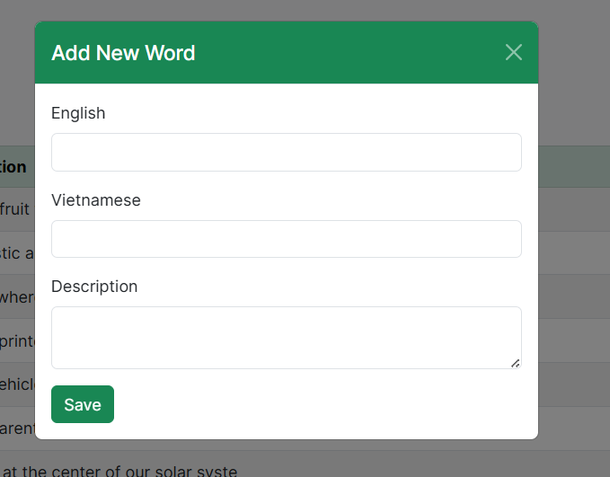

Flashcards Vocabulary App

Mô tả dự án:
Đây là một website học từ vựng tiếng Anh, giúp người dùng học nhanh và thú vị thông qua Flashcards và Quiz. Dự án gồm các chức năng chính:
+ Quản lý từ vựng (thêm, sửa, xóa từ)
+ Học từ vựng qua Flashcards
+ Kiểm tra kiến thức bằng Quiz

Hướng dẫn sử dụng
Mở index.html trên trình duyệt.
Nhấn Bắt đầu học để vào trang menu.
Chọn một chức năng:
Quản lý từ vựng: thêm/sửa/xóa từ vựng.
Học: học từ vựng theo flashcards.
Quiz: làm bài kiểm tra nghĩa từ.
